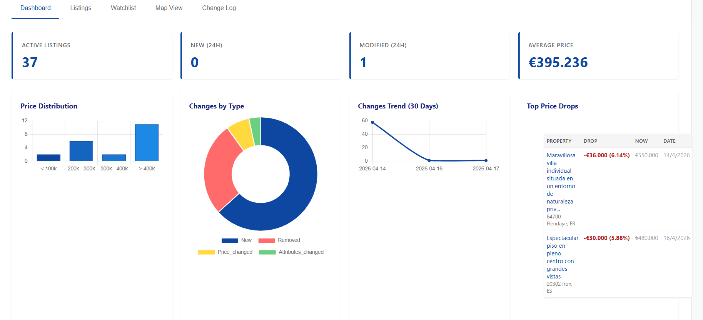
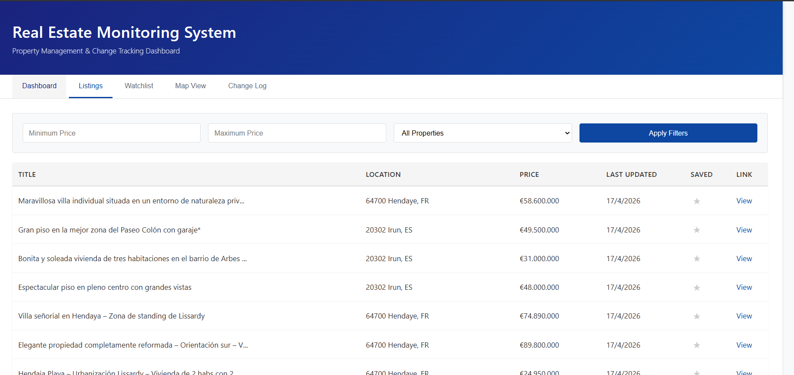
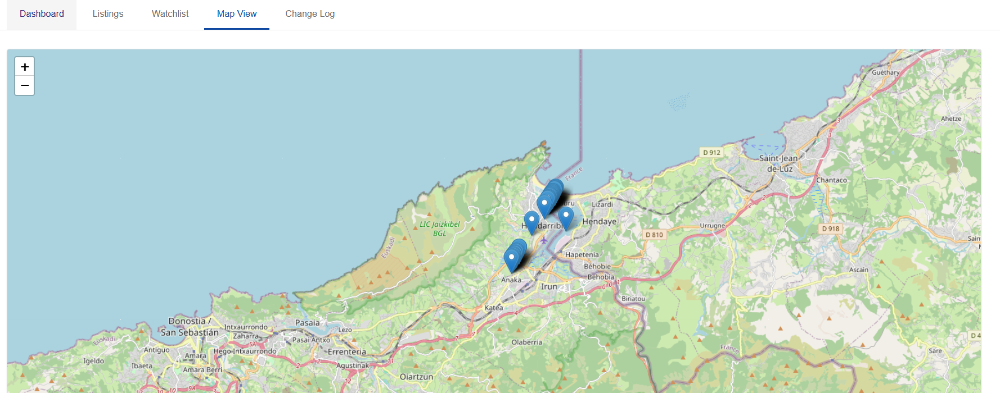
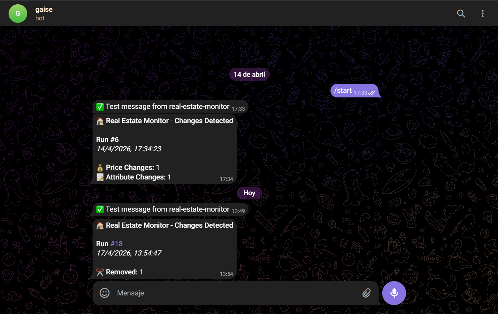

# Real Estate Monitoring Project - Final Report

## Who I am and what I did
I am Urdax and I am the developer of this repository. I built a complete real-estate monitoring pipeline across the milestones. The project scrapes listings, stores historical data, detects changes, sends Telegram alerts, and provides a dashboard for monitoring.

Main work delivered:
- Implemented scraping pipeline with adapter-based architecture (Milestone 1).
- Added persistence in SQLite (local) and Turso (cloud) (Milestone 2).
- Implemented monitoring for new/changed/removed listings (Milestone 3).
- Added Telegram notifications for change events (Milestone 4).
- Added scheduler for periodic execution (Milestone 5).
- Built a web dashboard with live stats, charts, change log, and insights (Milestone 6).

## Milestones status
- Milestone 1: Base scraping and extraction (completed).
- Milestone 2: Data persistence (SQLite + Turso) (completed).
- Milestone 3: Monitoring tables and change detection (completed).
- Milestone 4: Telegram bot notifications (completed).
- Milestone 5: Scheduled execution and automation (completed).
- Milestone 6: Dashboard website and analytics features (completed).
- Milestone 7: Cloud server deployed on UpCloud (Ubuntu 24.04) and dashboard startup validated (completed).
- Milestone 8: Production deployment configured with Nginx reverse proxy (port 80 -> 3000) (completed).
- Milestone 9: Not completed.

Optional milestone completed:
- Extra Telegram alerting validation and delivery evidence (Milestone 4 feature).

## Domain name / IP
Production deployment is running on UpCloud (Ubuntu 24.04) and is exposed through Nginx reverse proxy.

Validated endpoints:
- http://localhost:3000
- http://127.0.0.1:3000

Milestone deployment evidence:
- http://5.22.218.242
- Server created in UpCloud: https://hub.upcloud.com/account/sessions
- Current status: remote server is deployed and the dashboard process launches correctly.

Custom DNS domain was not configured because DNS access remained outside project permissions.

## Production deployment
Deployment stack:
- Provider and OS: UpCloud Ubuntu 24.04
- Application runtime: Node.js (ESM project with "type": "module")
- Reverse proxy: Nginx forwarding port 80 to 127.0.0.1:3000

Real entry point for dashboard:
- Correct command: `node scrape.js --dashboard --port 3000`
- Not used as entry point: `node src/dashboard.js`

Environment variables:
- The `.env` file must be located in the root of Milestone 6 (same folder as `scrape.js`).
- `scrape.js` loads environment variables automatically with `import 'dotenv/config'`.

Process execution in production:
- Quick persistent run: `nohup node scrape.js --dashboard --port 3000 > dashboard.log 2>&1 &`
- Recommended process manager: PM2
- Start with PM2: `pm2 start scrape.js --name real-estate-dashboard -- --dashboard --port 3000`
- Persist PM2 process list: `pm2 save`
- Enable startup on reboot: `pm2 startup`

## Server installation (Ubuntu 24.04)
1. Install Node.js LTS and Nginx:
  ```bash
  sudo apt update
  sudo apt install -y nginx curl
  curl -fsSL https://deb.nodesource.com/setup_20.x | sudo -E bash -
  sudo apt install -y nodejs
  ```
2. Go to the project and install dependencies:
  ```bash
  cd /path/to/GAISE/milestone\ 6
  npm install
  ```
3. Create and validate environment variables in `.env` (Milestone 6 root).
4. Start the dashboard service:
  ```bash
  node scrape.js --dashboard --port 3000
  ```
  For background execution:
  ```bash
  nohup node scrape.js --dashboard --port 3000 > dashboard.log 2>&1 &
  ```
5. Configure Nginx as reverse proxy (80 -> 3000):
  ```nginx
  server {
     listen 80;
     server_name _;

     location / {
        proxy_pass http://127.0.0.1:3000;
        proxy_http_version 1.1;
        proxy_set_header Host $host;
        proxy_set_header X-Real-IP $remote_addr;
        proxy_set_header X-Forwarded-For $proxy_add_x_forwarded_for;
        proxy_set_header X-Forwarded-Proto $scheme;
     }
  }
  ```
6. Validate and reload Nginx:
  ```bash
  sudo nginx -t
  sudo systemctl reload nginx
  ```

## Adapters implemented
The project uses an adapter registry design so each website has an independent scraper implementation while the CLI stays uniform.

Implemented adapters:
- `iparralde` adapter:
  - Implemented with Playwright.
  - Supports filters (property type and municipality).
  - Handles pagination across result pages.
  - Generates stable listing IDs from detail URLs.
  - Normalizes extracted title, location, and price text.

Adapter architecture summary:
- Adapter registry maps `siteId -> scraper function`.
- CLI resolves an adapter by `--site` and executes it.
- New websites can be added by creating a new adapter module and registering it in the adapter index.

## Problems encountered
Main issues during implementation:
- Dynamic website behavior and pagination synchronization.
- European price format parsing (`16.000,00 EUR`) causing numeric inconsistencies.
- False positive `price_changed` records due legacy normalization.
- Duplicate listing entries in top price-drop insights.
- Missing local Telegram credentials in `.env`.
- Initial program launch failures on the deployed UpCloud server due incorrect startup entry point.

How they were solved:
- Improved parsing and normalization for European prices.
- Added cleanup and noise filtering for historical change events.
- Added deduplication logic by listing ID in dashboard insights.
- Added tests for parser and normalization-noise filters.
- Validated Telegram configuration with test command.
- Switched to the correct dashboard entry point command: `node scrape.js --dashboard --port 3000`.
- Confirmed `.env` placement in Milestone 6 root and ESM runtime configuration.
- Added Nginx reverse proxy configuration for production traffic on port 80.

## Additional comments
- Dashboard includes live stats, price distribution, change-type chart, trend chart, and top price drops.
- Telegram notifications were tested end-to-end.
- The codebase is modular and ready for adding more adapters/sites.
- Milestone 7 deployment on UpCloud is operational and the dashboard startup is validated.
- Milestone 8 production deployment is operational through Nginx reverse proxy (80 -> 3000).
- Requirement 9 was not completed.

## Screenshots (highlighted features)

### Dashboard (Milestone 6, localhost)
- Overview:
  - 
- Listings tab:
  - 
- Map view:
  - 

### Telegram bot (Milestone 4, optional evidence)
- Telegram alert example (Milestone 4):
  - 

